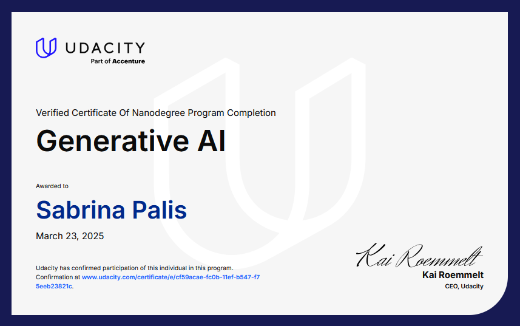

<div align="center">

# 🚀 Generative AI Early Projects Portfolio

### Foundation Models • LLM Applications • Computer Vision • RAG Systems


</div>

---

# Overview

This repository gathers a collection of projects completed during the **Applied Generative AI Nanodegree**.

Together, these projects explore the practical application of modern Generative AI technologies, including:

* Foundation Models
* Parameter-Efficient Fine-Tuning (PEFT)
* Large Language Models (LLMs)
* Prompt Engineering
* Natural Language Processing
* Computer Vision
* Image Generation and Editing
* Retrieval-Augmented Generation (RAG)
* Vector Databases
* AI-Powered Applications

While educational in origin, the projects provided hands-on experience with many of the techniques currently used in modern AI products and intelligent applications.

---

# Learning Journey

This portfolio follows a progression from foundation models toward practical AI applications.

```text
Project 1
Foundation Models & Fine-Tuning
            ↓

Project 2
Custom LLM Applications
            ↓

Project 3
Generative Computer Vision
            ↓

Project 4
Retrieval-Augmented AI Systems
```

---

# Portfolio Projects

---

## 🧠 Project 1 — Lightweight Fine-Tuning of a Foundation Model

### Parameter-Efficient Adaptation of Large Language Models

This project explores how large foundation models can be adapted to specific tasks using lightweight fine-tuning techniques.

Key concepts:

* Foundation Models
* Transformers
* Hugging Face Ecosystem
* PEFT
* Transfer Learning
* Model Adaptation

### Highlights

* Fine-tuned a pre-trained language model
* Applied parameter-efficient training methods
* Reduced computational requirements
* Evaluated model performance before and after adaptation

📁 Folder: `01-lightweight-fine-tuning`

---

## 💬 Project 2 — Custom LLM Chatbot

### Building Conversational AI with Large Language Models

This project focuses on developing a custom chatbot powered by modern language models.

Key concepts:

* Large Language Models
* Prompt Engineering
* Conversational AI
* NLP
* Transformer Architectures
* Dialogue Systems

### Highlights

* Built a custom chatbot
* Designed prompt strategies
* Explored strengths and weaknesses of LLMs
* Implemented conversational workflows

📁 Folder: `02-custom-llm-chatbot`

---

## 🎨 Project 3 — AI Photo Editing with Inpainting

### Generative Computer Vision and Image Editing

This project explores image generation and editing using modern Generative AI techniques.

Key concepts:

* Computer Vision
* Diffusion Models
* Image Generation
* Inpainting
* Generative Imaging
* Visual AI

### Highlights

* Performed AI-assisted image editing
* Used inpainting techniques
* Explored image generation workflows
* Applied generative computer vision methods

📁 Folder: `03-ai-photo-editing-inpainting`

---

## 🏠 Project 4 — Personalized Real Estate Agent

### Retrieval-Augmented Generation for Domain-Specific AI Applications

This project demonstrates how retrieval systems can enhance generative AI applications by grounding responses in external data sources.

Key concepts:

* Retrieval-Augmented Generation (RAG)
* Vector Databases
* LangChain
* Semantic Search
* Embeddings
* Domain-Specific AI Assistants

### Highlights

* Built a personalized AI assistant
* Implemented retrieval-based reasoning
* Connected generative AI with external knowledge
* Created a practical end-user application

📁 Folder: `04-personalized-real-estate-agent`

---

# Skills Demonstrated

## Generative AI

* Foundation Models
* Fine-Tuning
* Prompt Engineering
* Large Language Models
* Conversational AI

## Machine Learning

* Deep Learning
* Transfer Learning
* Transformer Architectures
* Model Evaluation

## Computer Vision

* Generative Imaging
* Inpainting
* Image Processing
* AI-Assisted Editing

## Retrieval Systems

* Retrieval-Augmented Generation
* Vector Databases
* Semantic Search
* Embeddings

## Software Engineering

* Python
* Jupyter Notebooks
* Modular Development
* AI Workflow Design

---

# Technologies

| Category                | Technologies                  |
| ----------------------- | ----------------------------- |
| Programming             | Python                        |
| Deep Learning           | PyTorch                       |
| Transformers            | Hugging Face                  |
| LLMs                    | Foundation Models             |
| Computer Vision         | Diffusion-Based Image Editing |
| Retrieval               | Vector Databases              |
| Frameworks              | LangChain                     |
| Development Environment | Jupyter Notebook              |

---

# Reflections

One of the most valuable aspects of this portfolio was observing how modern Generative AI systems build upon a common foundation.

The progression from:

* adapting foundation models,
* to building conversational systems,
* to generating and editing images,
* to grounding AI responses through retrieval,

illustrates how diverse AI applications often share the same underlying principles.

These projects provided practical exposure to the technologies and architectural patterns that now power many AI assistants, content generation systems, creative tools, and domain-specific intelligent applications.

---

# Educational Context

This repository contains my implementations of projects completed during the **Applied Generative AI Nanodegree**.

The repository is intended as a portfolio documenting my learning journey and engineering work in Generative AI.

Project specifications originated from Udacity coursework; however, all implementations, documentation, reports, notebooks, architectural decisions, and code submissions are my own unless explicitly stated otherwise.

---

# Certificate

This repository accompanies my completion of the **Applied Generative AI Nanodegree**, focused on practical applications of foundation models, fine-tuning, computer vision, retrieval systems, and AI-powered application development.

<p align="center">
  
</p>

---

# Author

### S. Palis

**AI Systems • Applied AI Education • Computational Research**

Exploring Generative AI, Agentic AI, Retrieval Systems, Scientific Discovery Tools, and Human-Centered AI Architectures.

GitHub: https://github.com/MinervaRose

LinkedIn: https://www.linkedin.com/in/sabrina-jp/

---

## Attribution

These projects were completed as part of the Udacity Applied Generative AI Nanodegree.

The project concepts, specifications, and educational framework were provided by Udacity.

All code, implementations, documentation, workflow designs, reports, and deliverables contained in this repository are my own work unless otherwise noted.

Udacity retains ownership of its course materials, project descriptions, and instructional content.

</div>
